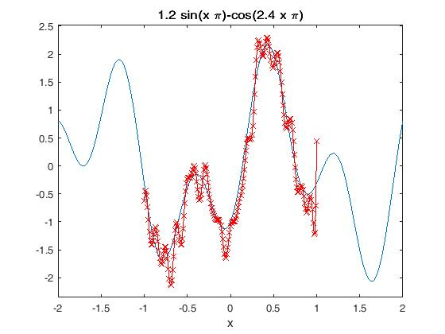
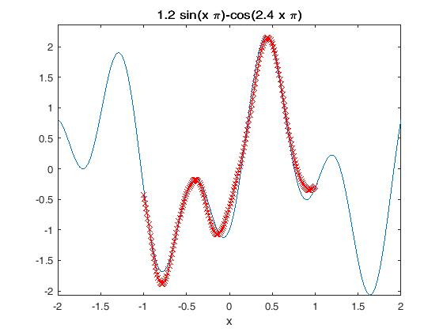
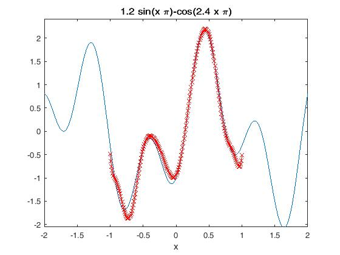
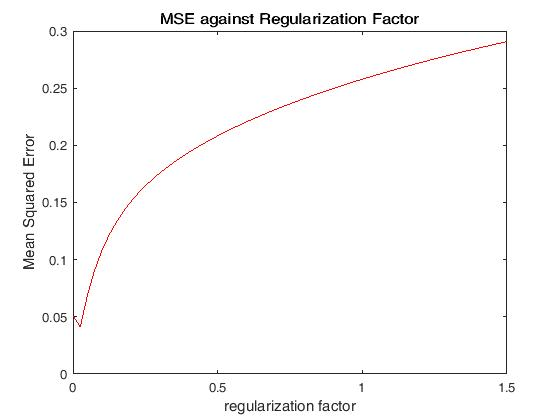

# Radial Basis Function Networks (RBFN) #

## Introduction ##

This RBFN attempts to approximate the following function:

The training set is constructed by dividing the range [-1,1] with steps of 0.05.  The test set is constructed by dividing the range [-1,1] with steps of 0.01.  The training set is corrupted by random noise as follows.
 

The random noise n(i) is Gaussion with 0 mean and standard deviation of 1.

## Contents ##

- **RBFN\_exact\_interpolation\_method.m** trains and tests an RBFN constructed using the Exact Interpolation method. The Radial Basis Function (RBF) is gaussian with standard deviation of 0.1 :
 where sigma = 0.1.  The resulting plot with test results in red and desired results in blue:

- **RBFN\_exact\_interpolation\_method\_with\_regularization.m** trains and tests an RBFN constructed using the Exact Interpolation method with regularization factor 0.5. The Radial Basis Function (RBF) is gaussian with standard deviation of 0.1.

- **RBFN\_Fixed\_Centers\_Selected\_at\_Random.m** trains and tests an RBFN constructed using the Fixed Centers Selected at Random method. The number of centers is set to be 15.  15 centroids from K-means clustering (K:=15) of training data are used as centers.  The Radial Basis Function (RBF) is:

&nbsp;&nbsp;&nbsp;&nbsp;&nbsp;&nbsp;&nbsp;&nbsp;

&nbsp;&nbsp;&nbsp;&nbsp;&nbsp;&nbsp;&nbsp;&nbsp;where mu\_i is the i-th fixed center and sigma\_i is:
 
&nbsp;&nbsp;&nbsp;&nbsp;&nbsp;&nbsp;&nbsp;&nbsp;

&nbsp;&nbsp;&nbsp;&nbsp;&nbsp;&nbsp;&nbsp;&nbsp;where d_max is the maximum distance between the chosen centers.

&nbsp;&nbsp;&nbsp;&nbsp;&nbsp;&nbsp;&nbsp;&nbsp;

- **RBFN\_Fixed\_Centers\_Selected\_at\_Random\_with\_regularization.m** trains and tests an RBFN constructed using the Fixed Centers Selected at Random method with various regularization factors.  A graph of Mean Squared Error (MSE) against regularization factor is plotted.  When the random number generator is seeded with 20, the minimum MSE obtained is 0.041085. This is achieved with 0.025 regularization factor.  Only seeds 12, 15, 20 out of seeds 1 to 20 result in noise that gives an improved MSE with non-zero regularization factor.  The design parameters are similar to *RBFN\_Fixed\_Centers\_Selected\_at\_Random.m*.

## Running ##

Run these .m files like how you would regular MATLAB .m files.  These .m files were developed on MATLAB R2012a.

## Keywords ##
Radial Basis Function Networks, RBFN, Artificial Neural Networks, ANN, MATLAB

## Acknowledgments ##

These codes were implemented in fulfilment of an assignment (EE5904R Neural Networks Homework #3) from the National University of Singapore (NUS).  I do not take credit for the creation of this assignment.  I wrote these codes, not the assignment.